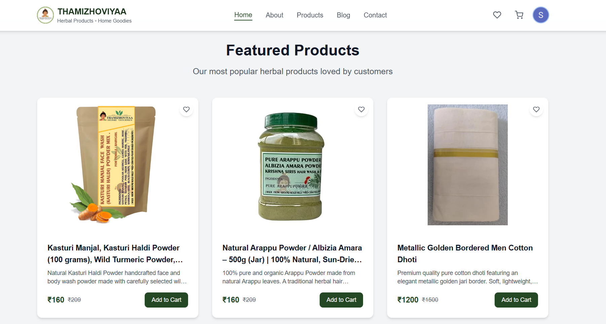
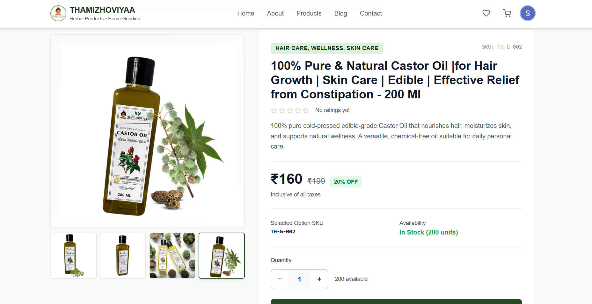
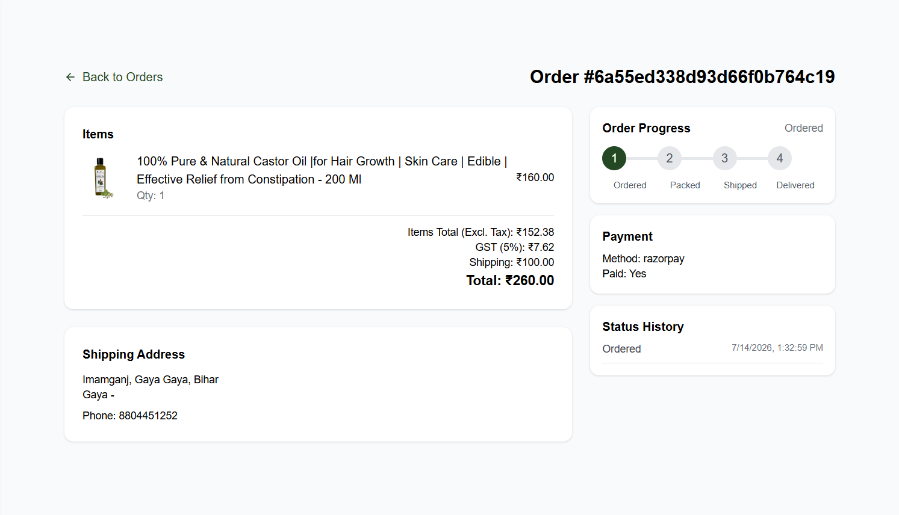
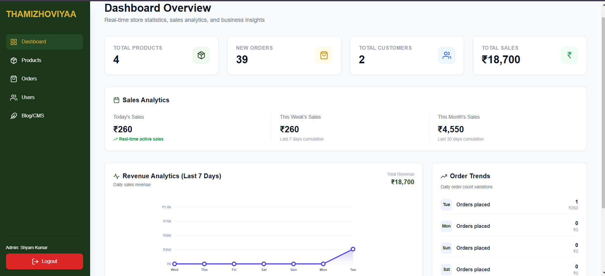
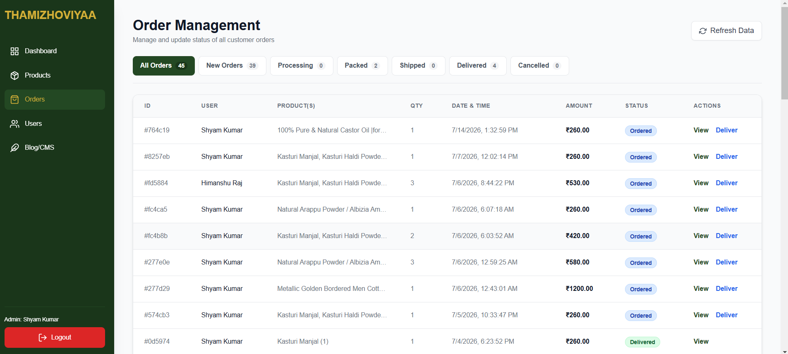
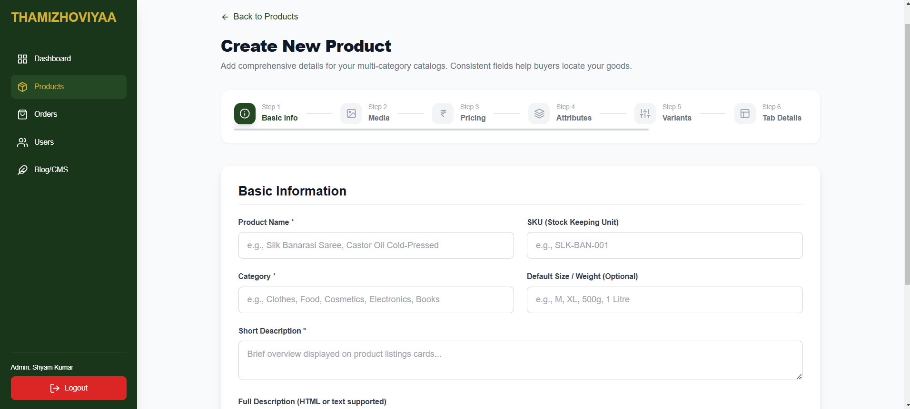
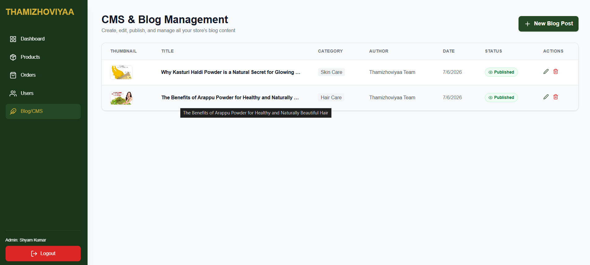

# 🛍 Thamizhoviyaa E-Commerce Storefront

[](https://react.dev/)
[](https://vite.dev/)
[](https://tailwindcss.com/)
[](https://mui.com/)
[](https://www.framer.com/motion/)
[](https://clerk.com/)
[](https://razorpay.com/)

A premium, highly interactive, and responsive web application frontend built using **React 19**, **Vite**, **Tailwind CSS**, and **Material-UI (MUI)**. Implemented with smooth animations powered by **Framer Motion**, dynamic state management via custom Context Providers, and fully integrated checkout pipelines.

---

## 🔗 Project Links & Live Demo
* **Live Storefront URL:** [https://thamizhoviyaa.vercel.app](https://thamizhoviyaa.vercel.app)
* **Backend API Repository:** [Backend GitHub Repo](https://github.com/MarsalShyam/Thamizhoviyaa-ecommerce-backend.git)
* **Hosting Platform:** Vercel (Optimized for React routing)

---

## 📸 Screenshots

<div align="center">

### 🌐 Customer Experience

| 🏠 Home Page & Hero | 🛍️ Product Collection Grid |
|:---:|:---:|
|  |  |

| 📦 Product Detail Page | 📋 Order Tracking |
|:---:|:---:|
|  |  |

---

### ⚙️ Admin Panel

| 📊 Admin Dashboard | 🚚 Order Management |
|:---:|:---:|
|  |  |

| ➕ Add New Product | 📝 Create Blog Post |
|:---:|:---:|
|  |  |

</div>

---

## ✨ Primary Features

### 🛒 Client Storefront Experience
* **Stunning Hero & Carousel Banners:** Styled with Tailwind CSS, utilizing `react-alice-carousel` for smooth slide transitions.
* **Smart Search & Filters:** Instantly search through catalog items, sort by pricing, and filter by categories/tags.
* **Persistent Cart & Wishlist:** Connected to state contexts that synchronize local items with MongoDB profiles in real-time.
* **User Address Book Management:** Edit details, set default shipping/billing locations, and manage profiles inside a dedicated user portal.
* **Interactive Checkout Page:** Displays a step-by-step cart summary, address selector, payment options, and links to the Razorpay SDK checkout modal.
* **Secure Auth Portal:** Clerk-powered login & signup screens with Single Sign-On (SSO) support.

### 🛡 Admin Command Center
* **Live Dashboard Statistics:** Display total sales figures, net revenue graphs, and active user count metrics.
* **Product Catalog CMS:** Add new items, upload images directly to Cloudinary, edit price, sizing, and manage inventory indicators.
* **Order Status Pipeline:** View all customer invoices, track shipments, and transition order stages (Ordered ➜ Packed ➜ Shipped ➜ Delivered).
* **Blog CMS:** Manage and update educational and marketing blogs directly via the control panel.
* **User Accounts List:** View registered customer directory profiles.

---

## ⚙ Setup & Installation Guide

Follow these steps to run the frontend application locally:

### 1. Prerequisites
* [Node.js](https://nodejs.org/) (v18.0.0 or higher)
* [npm](https://www.npmjs.com/) package manager

### 2. Install Dependencies
Clone this repository, navigate to the frontend folder, and run:
```bash
cd frontend
npm install
```

### 3. Setup Environment Variables
Create a `.env` file in the root of the `/frontend` directory and add the following keys:

```ini
# Backend API Base URL
VITE_BACKEND_URL="http://localhost:5000"

# Clerk Publishable Key (From Clerk Dashboard -> API Keys)
VITE_CLERK_PUBLISHABLE_KEY="pk_test_..."

# Razorpay Client Key ID (From Razorpay Dashboard -> API Keys)
VITE_RAZORPAY_KEY_ID="rzp_test_..."

# EmailJS credentials (For Contact page form submissions)
VITE_EMAILJS_SERVICE_ID="service_..."
VITE_EMAILJS_TEMPLATE_ID="template_..."
VITE_EMAILJS_PUBLIC_KEY="..."
```

### 4. Running the Application

* **Start Local Development Server (Vite HMR):**
  ```bash
  npm run dev
  ```
  The app will be available at `http://localhost:5173`.

* **Build Production Bundle:**
  ```bash
  npm run build
  ```

* **Preview Production Build Locally:**
  ```bash
  npm run preview
  ```

* **Run ESLint Checks:**
  ```bash
  npm run lint
  ```

---

## 📂 Project Architecture

```text
frontend/
├── public/                 # Static assets, favicon, screenshots
├── src/
│   ├── assets/             # Brand logos and general image assets
│   ├── components/         # Reusable layouts, buttons, headers, routers
│   │   ├── Header.jsx      # Navigation bar with responsive cart drawers
│   │   ├── AdminLayout.jsx # Sidebar layout for Admin dashboard
│   │   └── ProtectedRoute.jsx
│   ├── context/            # Global contexts (AuthContext, CartContext)
│   ├── data/               # Static/mock data definitions
│   ├── pages/              # Routed pages
│   │   ├── Admin/          # Dashboard, CMS, Product & Order Management
│   │   ├── User/           # Profile layout, Address Management, Order Lists
│   │   ├── Home.jsx        # Landing Page featuring hero sections & grid
│   │   ├── ProductDetail.jsx # Dynamic view showing info, reviews & variations
│   │   └── Checkout.jsx    # Interactive checkout page with Razorpay API hook
│   ├── App.jsx             # Main routing registry
│   ├── index.css           # Global Tailwind utilities
│   └── main.jsx            # DOM render entry point
├── tailwind.config.js      # Custom theme extension configs
├── vite.config.js          # Vite configurations (plugins, server routing)
└── package.json            # Dependencies and scripts listing
```

---

## 🚀 Deployment Guide (Vercel)

This frontend contains a `vercel.json` file configured to handle React client-side routing properly. To deploy:

1. Connect your GitHub repository to [Vercel](https://vercel.com).
2. Set the root directory configuration to `frontend`.
3. Add the required environment variables (`VITE_BACKEND_URL`, `VITE_CLERK_PUBLISHABLE_KEY`, etc.) inside the Vercel Project Settings.
4. Click **Deploy**. Vercel will build the Vite project and host it automatically.
